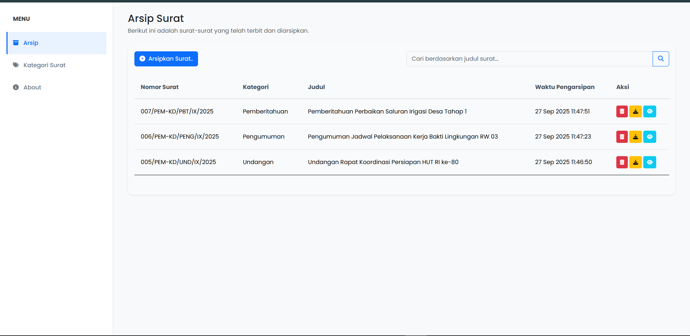
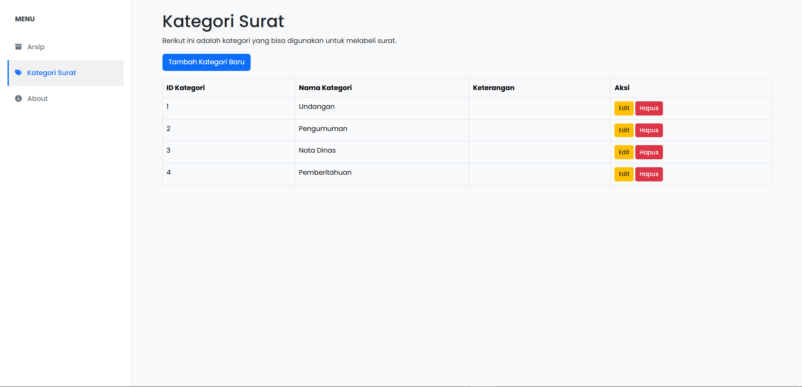
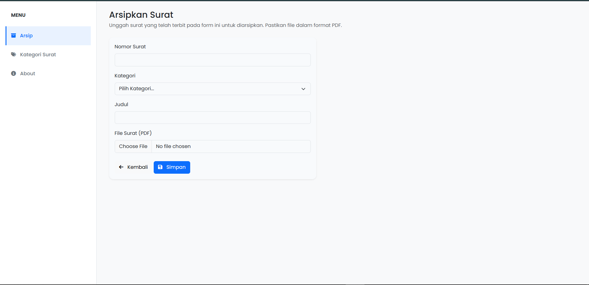
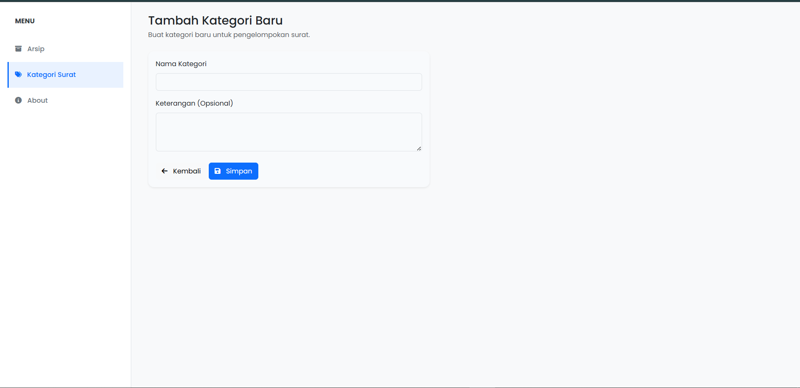
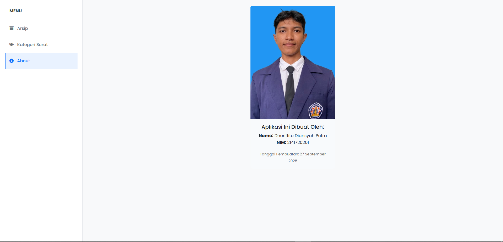

# Aplikasi Arsip Surat

## Tujuan Aplikasi
Aplikasi ini dibuat untuk memenuhi kebutuhan dalam mengarsipkan surat-surat resmi yang diterbitkan secara digital dalam format PDF.

## Fitur
- Mengarsipkan surat (upload file PDF).
- Menampilkan daftar surat yang telah diarsipkan.
- Melakukan pencarian surat berdasarkan judul.
- Mengunduh file surat yang tersimpan.
- Melihat detail dan preview surat.
- Menghapus data surat.
- Manajemen Kategori Surat (Tambah, Edit, Hapus).

## Teknologi yang Digunakan
- **Framework**: Laravel 11
- **Bahasa**: PHP 8.2
- **Database**: MySQL
- **Frontend**: Bootstrap 5

## Cara Menjalankan Aplikasi
1. Clone repository ini: `git clone https://github.com/NasiUduk27/arsip-surat.git`
2. Masuk ke direktori proyek: `cd arsip-surat`
3. Install dependensi PHP: `composer install`
4. Salin file `.env.example` menjadi `.env`: `cp .env.example .env`
5. Generate application key: `php artisan key:generate`
6. Konfigurasi koneksi database Anda di file `.env`.
7. Buat database baru sesuai konfigurasi.
8. Jalankan migrasi untuk membuat tabel: `php artisan migrate`
9. Buat symbolic link untuk storage: `php artisan storage:link`
10. Install dependensi frontend: `npm install`
11. Kompilasi aset: `npm run dev`
12. Jalankan server development: `php artisan serve`
13. Buka aplikasi di browser pada alamat `http://127.0.0.1:8000`.

## Screenshot
Halaman Utama

Halaman Kategori

Halaman Tambah Surat

Halaman Tambah Kategori

Halaman About

